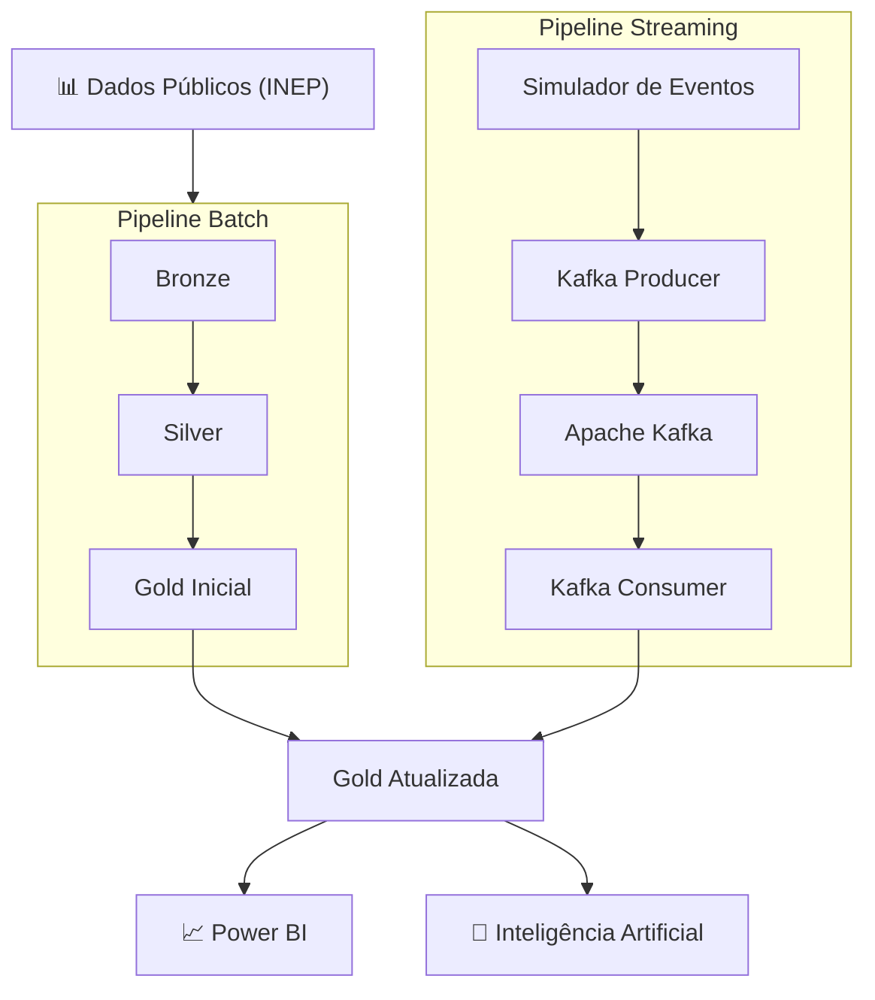
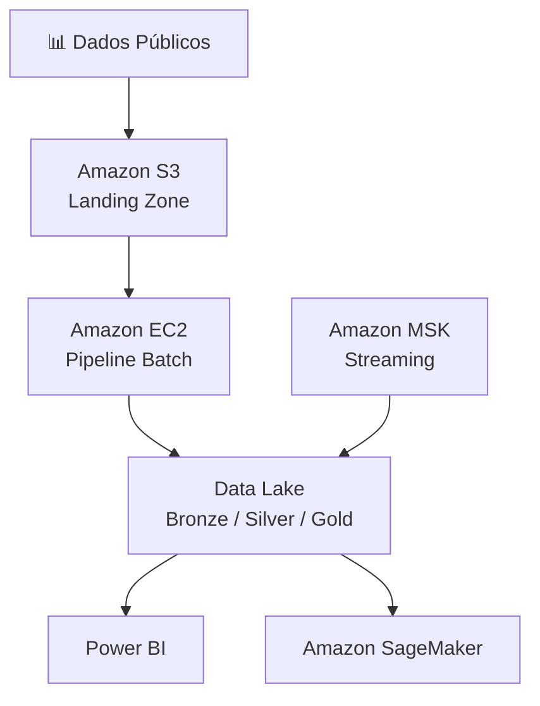
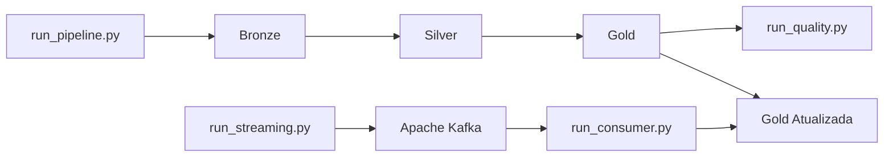

# Plataforma Híbrida de Engenharia de Dados para Indicadores Educacionais

## Sobre o Projeto

Esta solução implementa uma plataforma híbrida de Engenharia de Dados para processamento de indicadores educacionais públicos, combinando pipelines Batch e Streaming para construir e manter uma camada analítica confiável, escalável e preparada para consumo por ferramentas de Business Intelligence e modelos de Inteligência Artificial.

A arquitetura foi desenvolvida com base na Arquitetura Medalhão (Bronze, Silver e Gold), utilizando processamento Batch para ingestão e transformação dos dados públicos do INEP e processamento Streaming com Apache Kafka para atualização incremental dos indicadores analíticos. Complementarmente, a solução incorpora uma camada dedicada de qualidade de dados, conteinerização com Docker e implantação em Cloud fundamentada em princípios de FinOps para otimização dos custos operacionais.

Embora desenvolvida como parte do Tech Challenge da FIAP, a arquitetura foi concebida seguindo práticas utilizadas em projetos corporativos de Engenharia de Dados, priorizando modularidade, baixo acoplamento, reprodutibilidade e facilidade de evolução.

---

## Sumário

- [Sobre o Projeto](#sobre-o-projeto)
- [Principais Capacidades](#principais-capacidades-da-solução)
- [Objetivos](#objetivos)
- [Arquitetura da Solução](#arquitetura-da-solução)
- [Pipeline Batch](#pipeline-batch)
- [Pipeline Streaming](#pipeline-streaming)
- [Camada Quality](#camada-quality)
- [Monitoramento da Pipeline](#monitoramento-da-pipeline)
- [Estrutura do Projeto](#estrutura-do-projeto)
- [Arquitetura Cloud](#arquitetura-cloud)
- [Decisões Arquiteturais](#decisões-arquiteturais)
- [Estratégia FinOps](#estratégia-finops)
- [Aplicações em BI e IA](#aplicações-em-bi-e-inteligência-artificial)
- [Tecnologias](#tecnologias-utilizadas)
- [Como Executar](#como-executar)
- [Resultados](#resultados-obtidos)
- [Conclusão](#conclusão)

## Principais Capacidades da Solução

| Capacidade | Implementação |
|------------|---------------|
| Arquitetura Medalhão | ✅ Camadas Bronze, Silver e Gold |
| Processamento Batch | ✅ Pipeline ETL em Python |
| Processamento Streaming | ✅ Apache Kafka |
| Atualização Incremental | ✅ Consumer Kafka |
| Qualidade de Dados | ✅ Camada dedicada de validação |
| Conteinerização | ✅ Docker Compose |
| Arquitetura Cloud | ✅ AWS |
| Estratégia FinOps | ✅ Otimização de armazenamento e processamento |
| Consumo Analítico | ✅ Dados preparados para BI e IA |

---

## Objetivos

A solução foi projetada para transformar dados públicos educacionais em ativos analíticos confiáveis, reduzindo a complexidade de processamento e disponibilizando informações estruturadas para diferentes perfis de consumo.

Os principais objetivos do projeto são:

- Construir uma arquitetura de dados baseada na Arquitetura Medalhão.
- Implementar pipelines Batch para ingestão, tratamento e enriquecimento dos dados.
- Incorporar processamento Streaming para atualização incremental dos indicadores analíticos.
- Garantir qualidade dos dados antes da disponibilização da camada analítica.
- Estruturar uma solução preparada para implantação em ambientes Cloud.
- Aplicar princípios de FinOps visando eficiência operacional e otimização de custos.
- Disponibilizar uma base de dados preparada para ferramentas de Business Intelligence e aplicações de Inteligência Artificial.

---

# Arquitetura da Solução



A solução adota uma arquitetura híbrida de processamento de dados, combinando pipelines Batch e Streaming que operam de forma independente e convergem para uma única camada analítica.

O processamento Batch é responsável pela construção inicial das camadas Bronze, Silver e Gold, realizando ingestão, padronização, enriquecimento e consolidação dos dados públicos do INEP.

Em paralelo, o pipeline Streaming utiliza Apache Kafka para processar novos eventos e atualizar incrementalmente a camada Gold, reduzindo a necessidade de reprocessamentos completos e aproximando a solução de arquiteturas modernas orientadas a eventos.

Essa abordagem permite combinar a robustez do processamento Batch com a agilidade do processamento Streaming, disponibilizando dados atualizados para ferramentas analíticas sem comprometer a eficiência operacional.

---

# Pipeline Batch

O pipeline Batch é responsável pela construção da base analítica da solução. Sua execução realiza a ingestão dos dados públicos educacionais, aplica transformações sucessivas e disponibiliza os datasets estruturados nas camadas Bronze, Silver e Gold.

A implementação foi desenvolvida em Python utilizando uma arquitetura modular, na qual cada etapa possui responsabilidades bem definidas e baixo acoplamento. A orquestração é realizada pelo `run_pipeline.py`, que executa sequencialmente os processos de construção das três camadas do Data Lake.

## Camada Bronze

A camada Bronze representa a zona de ingestão do Data Lake. Nessa etapa, os dados públicos são extraídos das fontes oficiais e armazenados em formato Parquet, preservando sua estrutura original e garantindo rastreabilidade das informações.

Principais responsabilidades:

- Ingestão dos dados públicos do INEP.
- Padronização inicial dos datasets.
- Persistência em formato Parquet.
- Preservação dos dados de origem.

---

## Camada Silver

A camada Silver concentra o tratamento e o enriquecimento dos dados.

Nesta etapa são realizadas transformações estruturais, padronização de atributos, definição de chaves de negócio e preparação dos datasets para consumo analítico.

Principais responsabilidades:

- Padronização dos atributos.
- Tratamento de inconsistências.
- Enriquecimento dos datasets.
- Consolidação das regras de negócio.

---

## Camada Gold

A camada Gold disponibiliza os datasets analíticos consumidos pelas aplicações.

Os dados são organizados para atender cenários de Business Intelligence e Inteligência Artificial, reduzindo a necessidade de novas transformações durante o consumo.

Os principais produtos analíticos gerados são:

- Indicadores municipais de alfabetização.
- Comparativo entre indicadores e metas.
- Evolução temporal dos indicadores.
- Dataset preparado para modelagem de IA.

---

# Pipeline Streaming

Além do processamento Batch, a solução incorpora um pipeline Streaming baseado em Apache Kafka para atualização incremental da camada Gold.

Diferentemente do processamento Batch, responsável pela construção inicial dos datasets analíticos, o Streaming opera continuamente sobre novos eventos, permitindo que os indicadores sejam atualizados sem necessidade de reprocessamento completo.

A arquitetura Streaming é composta pelos seguintes componentes:

- Simulador de eventos.
- Kafka Producer.
- Apache Kafka.
- Kafka Consumer.
- Atualização incremental da camada Gold.

Essa separação permite que processamento Batch e Streaming operem de forma independente, convergindo para a mesma camada analítica.

---

# Camada Quality

Após a construção dos datasets, a solução executa uma camada dedicada de validação da qualidade dos dados.

Essa etapa garante que os ativos analíticos disponibilizados atendam requisitos mínimos de consistência antes de serem consumidos pelas aplicações.

A arquitetura da camada Quality foi desenvolvida seguindo o mesmo padrão modular adotado na pipeline principal, centralizando as regras de validação em um único arquivo de configuração e desacoplando a lógica de validação da execução.

As principais verificações realizadas são:

- Existência dos datasets.
- Leitura dos arquivos Parquet.
- Validação de datasets vazios.
- Verificação de colunas obrigatórias.
- Validação de chaves de negócio.
- Identificação de registros duplicados.

Ao final da execução, um relatório consolidado apresenta o status de validação das camadas Bronze, Silver e Gold, permitindo rápida identificação de inconsistências antes da disponibilização dos dados para consumo analítico.

---

# Monitoramento da Pipeline

Embora o monitoramento completo seja um item opcional do desafio, a solução já incorpora mecanismos básicos de observabilidade que dão visibilidade sobre a execução da pipeline, servindo como base para uma futura estratégia de monitoramento em produção.

## O que já é monitorado

- **Falhas de ingestão**: cada etapa da camada Bronze é protegida por tratamento de exceção em `download_dataset.py`, que interrompe a pipeline e reporta o dataset que falhou, evitando que uma falha silenciosa comprometa as camadas seguintes.
- **Volume de dados processados**: a cada execução, `transform_dataset.py` e os scripts da camada Gold reportam quantidade de registros, colunas e duplicados de chave processados em cada dataset.
- **Qualidade dos dados**: a camada `quality/` consolida, ao final da execução, um relatório com o status (OK / falha) de cada dataset nas três camadas, permitindo identificar rapidamente qual etapa apresentou inconsistência.
- **Falhas no consumo de eventos**: o consumer Kafka (`streaming/consumer.py`) captura e reporta erros de mensagens (`msg.error()`) sem interromper o processamento dos demais eventos.

## Evolução proposta para ambiente Cloud

Em um ambiente de produção, a estratégia de monitoramento evoluiria para:

| Necessidade | Solução proposta |
|---|---|
| Centralização de logs | Amazon CloudWatch Logs, com os prints estruturados atuais migrando para logging estruturado (JSON) |
| Latência do pipeline | Métricas customizadas no CloudWatch a partir do tempo de execução de cada camada (Bronze/Silver/Gold) |
| Alertas de erro | CloudWatch Alarms + SNS para notificação em caso de falha de ingestão ou reprovação na camada Quality |
| Lag do consumer Kafka | Monitoramento de consumer lag via métricas nativas do Amazon MSK |

Essa abordagem incremental permite que a observabilidade evolua junto com a maturidade da plataforma, sem exigir reestruturação da pipeline atual.

---

# Estrutura do Projeto

A organização do projeto foi planejada para manter baixo acoplamento entre os componentes, facilitar manutenção e permitir evolução independente de cada módulo.

```text
.
├── data/
│   ├── bronze/
│   ├── silver/
│   └── gold/
│
├── docs/
│
├── notebooks/
│
├── pipelines/
│
├── quality/
│
├── streaming/
│
├── docker-compose.yml
├── requirements.txt
└── README.md
```

Cada diretório possui uma responsabilidade específica:

| Diretório | Responsabilidade |
|------------|------------------|
| `data/` | Armazenamento das camadas Bronze, Silver e Gold. |
| `pipelines/` | Implementação dos pipelines Batch. |
| `streaming/` | Processamento contínuo utilizando Apache Kafka. |
| `quality/` | Validação da qualidade dos datasets. |
| `notebooks/` | Exploração e análise dos dados. |
| `docs/` | Documentação complementar do projeto. |

---

# Arquitetura Cloud

Arquitetura foi projetada para permitir implantação em ambientes Cloud com mínimas adaptações.

Como arquitetura de referência, foi adotada a plataforma **Amazon Web Services (AWS)** devido à ampla disponibilidade de serviços gerenciados voltados para Engenharia de Dados, processamento distribuído e aplicações de Inteligência Artificial.

A proposta mantém a mesma organização lógica implementada durante o desenvolvimento, substituindo apenas a infraestrutura local pelos serviços equivalentes em Cloud.

## Arquitetura Proposta

A solução é composta por dois pipelines independentes — Batch e Streaming — que convergem para uma única camada analítica.

O pipeline Batch é responsável pela construção inicial do Data Lake, enquanto o pipeline Streaming realiza atualizações incrementais dos indicadores analíticos em tempo quase real.



Essa arquitetura preserva a separação entre processamento Batch e Streaming, permitindo que ambos evoluam de forma independente enquanto compartilham a mesma camada analítica.

---

# Decisões Arquiteturais

Ao longo do desenvolvimento, algumas decisões exigiram avaliar trade-offs entre abordagens distintas. As principais são resumidas a seguir (o detalhamento completo está em `docs/DECISIONS.md`).

## Batch vs Streaming

Optou-se por uma arquitetura híbrida em vez de escolher apenas uma abordagem. O Batch é responsável pela carga inicial e consolidação histórica (mais eficiente para grandes volumes processados periodicamente), enquanto o Streaming atualiza a camada Gold de forma incremental, evitando reprocessamentos completos a cada nova medição. O custo dessa escolha é a complexidade adicional de manter dois fluxos coordenados, mitigada pela configuração centralizada e por camadas desacopladas.

## Data Lake vs Data Warehouse

A solução adota um Data Lake baseado em arquivos Parquet organizados pela Arquitetura Medalhão, em vez de um Data Warehouse tradicional. Essa escolha prioriza flexibilidade de schema, menor custo de armazenamento e compatibilidade direta com ferramentas de Machine Learning, em detrimento de recursos nativos de um DW (como indexação e otimização automática de queries). Para consumo por BI, a camada Gold cumpre um papel equivalente ao de um DW analítico, sem o custo operacional de manter um cluster dedicado.

---

# Estratégia FinOps

A arquitetura proposta incorpora princípios de **FinOps** desde sua concepção, priorizando eficiência operacional e redução dos custos de armazenamento e processamento.

Em vez de depender exclusivamente de aumento de capacidade computacional, a solução busca reduzir desperdícios por meio de decisões arquiteturais.

As principais estratégias adotadas são apresentadas a seguir.

| Decisão Arquitetural | Benefício Operacional | Impacto em Custos |
|----------------------|-----------------------|-------------------|
| Formato Parquet | Compressão e leitura colunar | Redução de armazenamento e I/O |
| Arquitetura Medalhão | Reutilização das camadas | Evita reprocessamentos desnecessários |
| Pipeline Batch + Streaming | Processamento especializado por finalidade | Melhor utilização dos recursos computacionais |
| Atualização Incremental da Gold | Reprocessa apenas novos eventos | Redução do consumo de CPU |
| Apache Kafka | Processamento desacoplado | Maior eficiência operacional |
| Camada Quality | Identificação antecipada de inconsistências | Redução de retrabalho |
| Docker | Ambientes reproduzíveis | Menor custo de implantação e manutenção |
| Configuração Centralizada | Simplificação operacional | Redução do custo de evolução da solução |

Essa abordagem demonstra que decisões arquiteturais possuem impacto direto na sustentabilidade financeira da plataforma, alinhando a implementação aos princípios modernos de Engenharia de Dados em ambientes Cloud.

---

# Aplicações em BI e Inteligência Artificial

A camada Gold foi estruturada para disponibilizar datasets consolidados e preparados para consumo analítico, reduzindo a necessidade de transformações adicionais antes da utilização por modelos de Inteligência Artificial.

Os principais cenários de aplicação incluem:

- previsão da evolução dos indicadores de alfabetização;
- identificação de municípios com maior risco de não atingimento das metas;
- classificação de desempenho educacional;
- segmentação de municípios por perfil de alfabetização;
- construção de modelos preditivos utilizando aprendizado supervisionado.

Além das aplicações em IA, os datasets produzidos podem ser consumidos diretamente por ferramentas de Business Intelligence, permitindo construção de dashboards e indicadores estratégicos para apoio à tomada de decisão.

Essa abordagem amplia o potencial de reutilização da plataforma, transformando a camada Gold em um ativo de dados preparado tanto para análises descritivas quanto para aplicações avançadas baseadas em Machine Learning.

---

# Tecnologias Utilizadas

A solução foi desenvolvida utilizando tecnologias amplamente empregadas em projetos de Engenharia de Dados, priorizando ferramentas open source, reprodutibilidade e facilidade de implantação.

| Categoria | Tecnologia | Finalidade |
|------------|------------|------------|
| Linguagem | Python 3.12 | Implementação dos pipelines Batch, Streaming e Quality |
| Processamento de Dados | Pandas | Manipulação e transformação dos datasets |
| Persistência | Parquet | Armazenamento otimizado das camadas do Data Lake |
| Streaming | Apache Kafka | Processamento contínuo e atualização incremental |
| Containerização | Docker / Docker Compose | Padronização do ambiente de execução |
| Ambiente | Jupyter Notebook | Exploração e análise dos dados |
| Qualidade de Dados | Camada Quality | Validação automatizada dos datasets |
| Versionamento | Git / GitHub | Controle de versão e colaboração |

---

# Como Executar



## 1. Clonar o repositório

```bash
git clone <url-do-repositorio>

cd tech_challenge_2_alfabetizacao
```

---

## 2. Criar ambiente virtual

```bash
python -m venv .venv
```

Linux / macOS

```bash
source .venv/bin/activate
```

Windows

```powershell
.venv\Scripts\activate
```

---

## 3. Instalar as dependências

```bash
pip install -r requirements.txt
```

---

## 4. Iniciar o Apache Kafka

```bash
docker compose up -d
```

---

## 5. Executar o pipeline Batch

```bash
python -m pipelines.run_pipeline
```

Essa etapa realiza a construção das camadas Bronze, Silver e Gold.

---

## 6. Executar as validações de qualidade

```bash
python -m quality.run_quality
```

Ao final da execução será apresentado um relatório consolidado contendo a validação das três camadas do Data Lake.

---

## 7. Executar o pipeline Streaming

Inicializar o consumidor:

```bash
python -m streaming.run_consumer
```

Em outro terminal, publicar eventos:

```bash
python -m streaming.run_streaming
```

O Consumer processará os eventos recebidos e realizará a atualização incremental da camada Gold.

---

# Resultados Obtidos

Ao final da execução, a plataforma entrega:

- construção completa das camadas Bronze, Silver e Gold;
- validação automatizada da qualidade dos dados;
- atualização incremental dos indicadores por meio de Apache Kafka;
- datasets preparados para consumo analítico;
- estrutura organizada para implantação em ambientes Cloud.

Resultados da Implementação:

| Indicador             |            Resultado |
| --------------------- | -------------------: |
| Camadas implementadas |                    3 |
| Datasets Bronze       |                    6 |
| Datasets Silver       |                    6 |
| Datasets Gold         |                    4 |
| Total de datasets     |                   16 |
| Pipeline Batch        |                 100% |
| Pipeline Streaming    |                 100% |
| Camada Quality        |                 100% |
| Datasets aprovados    |              16 / 16 |
| Docker                |          Configurado |
| Kafka                 |          Operacional |
| Cloud                 |          Arquitetada |


Os principais datasets produzidos são:

| Dataset | Finalidade |
|----------|------------|
| indicador_municipio | Indicadores consolidados por município |
| comparativo_metas | Comparação entre indicadores e metas educacionais |
| evolucao_temporal | Evolução histórica dos indicadores |
| alunos_modelagem | Dataset preparado para aplicações de IA |


---

# Conclusão

A solução demonstra como uma arquitetura híbrida de Engenharia de Dados pode combinar processamento Batch e Streaming para construir uma plataforma analítica confiável, escalável e preparada para aplicações de Business Intelligence e Inteligência Artificial.

Ao integrar Arquitetura Medalhão, Apache Kafka, validação automatizada da qualidade dos dados, conteinerização com Docker e uma proposta de implantação em Cloud fundamentada em princípios de FinOps, o projeto evidencia práticas modernas de Engenharia de Dados aplicáveis tanto em ambientes acadêmicos quanto corporativos.

A solução demonstra que arquiteturas híbridas, combinando processamento Batch e Streaming, podem ser implementadas de forma modular, reproduzível e preparada para evolução em ambientes Cloud. Além de atender aos requisitos propostos, o projeto estabelece uma base consistente para futuras aplicações analíticas e modelos de Inteligência Artificial.